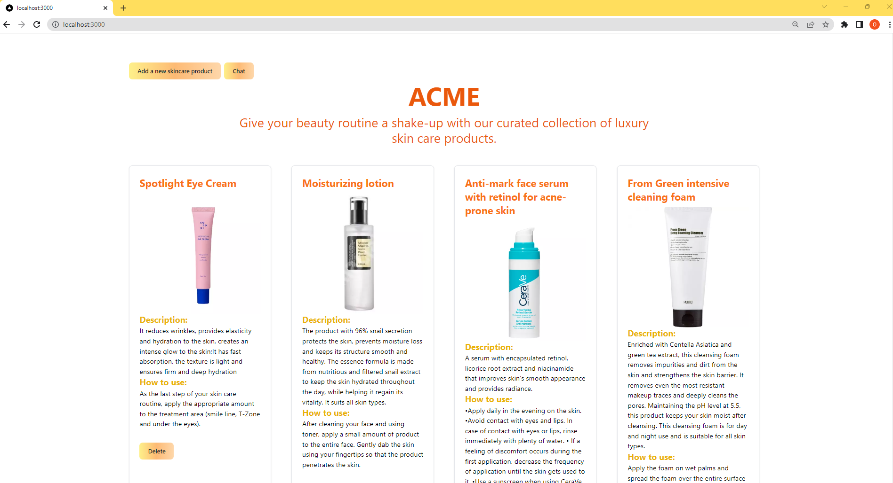
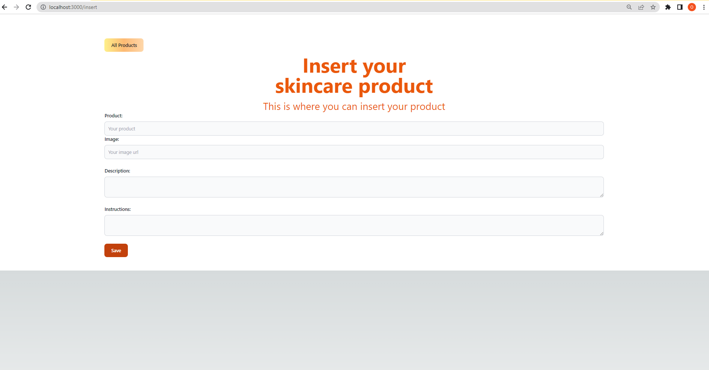

# ACME App

Student: Țone Iulia-Paula, SIMPRE, grupa 1121
### Introducere
În cadrul acestui proiect am ales să creez o aplicație web, folosind Next.js.
Am utilizat ca servicii în Cloud:
####	Baza de date MongoDB;
####	API-ul ChatGPT - pentru a integra funcționalitățile ChatGPT-ului;
####	Vercel – pentru deploymentul aplicației dezvoltate.

## Linkul către repository-ul public : [github](https://github.com/toneiulia/cc-next-2-main)
## Linkul către aplicația publică este următorul: [vercel](https://cc-next-2-main.vercel.app/)
## Linkul către prezentarea video este următorul: youtube

# Descriere problemă
Problema abordată de aplicația dezvoltată permite utilizatorilor să-și gestioneze și să-și urmărească rutina de îngrijire a tenului. În fiecare zi, oamenii folosesc diferite produse și tehnici pentru a-și menține pielea sănătoasă și frumoasă. Cu toate acestea, monitorizarea și organizarea acestor produse și proceduri pot deveni un proces dificil și confuz.
Aplicația dezvoltată vine în ajutorul utilizatorilor, oferindu-le un instrument convenabil pentru a-și gestiona rutina de îngrijire a pielii. Utilizatorii pot salva informații despre produsele pe care le utilizează, inclusiv detalii precum numele produsului, imagine sugestiva, descriere si modul de aplicare. Aceste informații sunt organizate într-un mod structurat și ușor de accesat.

# Descriere API
OpenAI API este o platformă de inteligență artificială (AI) care oferă acces la funcționalități avansate de limbaj natural prin intermediul interacțiunii cu modele de învățare profundă precum GPT-3.5. Această API permite dezvoltatorilor și utilizatorilor să integreze capabilități puternice de procesare a limbajului în aplicațiile, serviciile sau produsele lor.

Cu OpenAI API, utilizatorii pot accesa un model lingvistic extrem de sofisticat și contextual, capabil să genereze texte coerente și bogate în informații. Prin intermediul API-ului, se pot realiza diverse sarcini, cum ar fi răspunsul la întrebări, rezolvarea problemelor, conversația interactivă sau generarea de texte creative.

API-ul oferă un mecanism simplu de comunicare cu modelul de limbaj, permițând trimiterea de prompturi și primirea de răspunsuri relevante. Prin explorarea opțiunilor de configurare, utilizatorii pot personaliza și adapta modelul pentru a se potrivi nevoilor lor specifice. OpenAI API poate fi utilizat pentru a crea asistenți virtuali inteligenti, sisteme de recomandare, aplicații de chatbot, instrumente de traducere și multe altele.Astfel, pot interacționa cu acesta prin requesturi de tip GET și POST:


## Request de tip POST:
```
let response = await fetch('/api/answer', {
                    method: 'POST',
                    headers: {
                        'Content-Type': 'application/json',
                    },
                    body: JSON.stringify({
                        messages: filteredChatHistory,
                        type: 'skincare',
                    }),
                    signal: AbortSignal.timeout(20000),
                });
```
Fragmentul de cod prezentat demonstrează o solicitare de tip POST efectuată către ruta '/api/answer' a unei aplicații folosind metoda fetch. În această solicitare, se trimit anumite date către server pentru a obține un răspuns.

Atributele solicitării sunt următoarele:
Method: 'POST' - Specifică că se dorește efectuarea unei solicitări de tip POST.
Headers: 'Content-Type': 'application/json' - Setează antetul 'Content-Type' la valoarea 'application/json', indicând faptul că conținutul corpului cererii este în format JSON.
Body: JSON.stringify({...}) - Conține corpul cererii, care este un obiect JavaScript convertit în format JSON prin utilizarea metodei JSON.stringify(). Acest obiect conține două chei:
'messages': filteredChatHistory - Reprezintă un array de mesaje filtrate din istoricul de chat și este inclus în corpul cererii pentru a fi procesat de server.
'type': 'skincare' - Indică tipul de solicitare, în acest caz, 'skincare', ceea ce sugerează că aplicația se așteaptă să primească un răspuns relevant în domeniul îngrijirii pielii.
Signal: AbortSignal.timeout(20000) - Acesta specifică că se dorește întreruperea solicitării dacă nu se primește un răspuns în decurs de 20 de secunde (20000 milisecunde). Aceasta este o măsură de siguranță pentru a evita expunerea aplicației la întârzieri excesive sau cereri nerezolvate.

## Metode GET: prin care citesc date
o	http://localhost:3000/api/records - prin care obțin toate produsele din baza de date
Exemplu de request: http://localhost:3000/api/records
Exemplu de response: 
```
{
    "data": [
        {
            "_id": "646229008d7deaff681207e6",
            "title": "Spotlight Eye Cream",
            "image": "https://comenzi.bebetei.ro/gallery/10986/medium/soroci-so14-crema-de-ochi-spotlight-30g-5509.webp",
            "description": "It reduces wrinkles, provides elasticity and hydration to the skin, creates an intense glow to the skin;It has fast absorption, the texture is light and ensures firm and deep hydration",
            "instructions": "As the last step of your skin care routine, apply the appropriate amount to the treatment area (smile line, T-Zone and under the eyes)."
        },
        {
            "_id": "64626232865a79ee0eab34a1",
            "title": "Moisturizing lotion",
            "image": "https://comenzi.bebetei.ro/gallery/12193/medium/cosrx-lotiune-hidratanta-cu-96-extract-de-melci-100ml-5117.webp",
            "description": "The product with 96% snail secretion protects the skin, prevents moisture loss and keeps its structure smooth and healthy.\nThe essence formula is made from nutritious and filtered snail extract to keep the skin hydrated throughout the day, while helping it regain its vitality.\nIt suits all skin types.",
            "instructions": "After cleaning your face and using toner, apply a small amount of product to the entire face.\nGently dab the skin using your fingertips so that the product penetrates the skin."
        },
        {
            "_id": "6462651b865a79ee0eab34a3",
            "title": "Anti-mark face serum with retinol for acne-prone skin",
            "image": "https://comenzi.bebetei.ro/gallery/62058/medium/serum-anti-semne-cu-retinol-30-ml-cerave-526.webp",
            "description": "A serum with encapsulated retinol, licorice root extract and niacinamide that improves skin's smooth appearance and provides radiance. ",
            "instructions": "•Apply daily in the evening on the skin. \n•Avoid contact with eyes and lips. In case of contact with eyes or lips, rinse immediately with plenty of water. \n• If a feeling of discomfort occurs during the first application, decrease the frequency of application until the skin gets used to it. \n•Use a sunscreen when using CeraVe Anti-Mark Serum with Retinol.\n\n"
        },
        {
            "_id": "646265db865a79ee0eab34a4",
            "title": " From Green intensive cleaning foam",
            "image": "https://comenzi.farmaciatei.ro/gallery/985/medium/from-green-spuma-de-curatare-intensa-femei-150-ml_21823_1_1592477872.webp",
            "description": "Enriched with Centella Asiatica and green tea extract, this cleansing foam removes impurities and dirt from the skin and strengthens the skin barrier. It removes even the most resistant makeup traces and deeply cleans the pores. Maintaining the pH level at 5.5, this product keeps your skin moist after cleansing. This cleansing foam is for day and night use and is suitable for all skin types.",
            "instructions": "Apply the foam on wet palms and spread the foam over the entire surface of the skin with circular movements.\nAfter 30 seconds, rinse your face with plenty of water!\nStrength: The product does not contain chemical surfactants, such as SLS, SLES, but natural surfactants based on coconut plants to keep your skin healthy. This cleansing foam contains 20 essential ingredients needed for all skin types, including sensitive skin."
        },
        {
            "_id": "64626751865a79ee0eab34a6",
            "title": "Cicaplast B5 ultra-repairing soothing balm with multiple indications",
            "image": "https://comenzi.farmaciatei.ro/gallery/34117/medium/balsam-reparator-calmant-cicaplast-b5-40-ml-la-roche-posay-6561.webp",
            "description": "- suitable for babies, children and adults in cases of: fragile skin, irritations (very dry skin, discomfort), burning sensation, redness, irritations caused by diapers in babies;\n- also suitable for healing minor wounds, bruises, burns, scratches, cracked skin;\n- efficient and fast repair from the first day;\n- pro-massage formula;",
            "instructions": "Apply 2 times a day, after the cleaning routine, on dry skin. It can be applied in a generous layer, both on the face and on the body or lips. "
        }
    ]
}
```


## Metode POST: prin care creez date 
http://localhost:3000/api/records- inserez un nou produs in baza de date
Exemplu de request: 
```
{
  "title": "Spotlight Eye Cream",
  "image": "https://comenzi.bebetei.ro/gallery/10986/medium/soroci-so14-crema-de-ochi-spotlight-30g-5509.webp",
  "description": "It reduces wrinkles, provides elasticity and hydration to the skin, creates an intense glow to the skin;It has fast absorption, the texture is light and ensures firm and deep hydration",
  "instructions": "As the last step of your skin care routine, apply the appropriate amount to the treatment area (smile line, T-Zone and under the eyes)."
}

Exemplu de response: {
{
    "data": {
        "acknowledged": true,
        "insertedId": "64629380cf192c666b123a58"
    }
}
```
## Metoda DELETE: prin care șterg date
o	http://localhost:3000/api/records?id=64629380cf192c666b123a58- pe baza id-ului indicat, șterg produsul din baza de date
Exemplu de request: http://localhost:3000/api/records?id=64629380cf192c666b123a58
Exemplu de response: 
```{
    {
    "data": {
        "acknowledged": true,
        "deletedCount": 1
    }
}
```
## Autentificare
Pentru a utiliza OpenAI API, utilizatorul trebuie să urmeze pașii de mai jos.
Înregistrarea pe site-ul OpenAI: Utilizatorul trebuie să acceseze site-ul OpenAI (https://www.openai.com) și să creeze un cont pentru a obține acces la API-ul OpenAI. Termenii și condițiile asociate utilizării API-ului trebuie să fie citiți și înțeleși înainte de înregistrare.
Obținerea cheii de acces API: După înregistrare, utilizatorul trebuie să parcurgă procedura specificată de OpenAI pentru a obține cheia de acces API. Această cheie va fi utilizată pentru autentificare în solicitările către API-ul OpenAI.
Explorarea documentației API-ului: Utilizatorul trebuie să consulte documentația OpenAI API pentru a învăța despre metodele și endpoint-urile disponibile. Documentația oferă informații detaliate despre cum să se formeze și să se trimită solicitări către API, precum și despre parametrii și opțiunile disponibile.
Implementarea solicitărilor către API: Utilizatorul trebuie să utilizeze cheia de acces API în cadrul aplicației sau serviciului pe care îl dezvoltă pentru a efectua solicitări către API-ul OpenAI. Aceste solicitări pot fi efectuate utilizând biblioteci sau instrumente specifice, cum ar fi fetch() în JavaScript sau alte pachete și module de cerere HTTP, conform documentației și exemplelor disponibile.
Respectarea politicilor și regulilor de utilizare: Utilizatorul trebuie să respecte politicile și regulile de utilizare stabilite de OpenAI pentru utilizarea API-ului. Acestea includ aspecte precum limitările de utilizare, utilizarea responsabilă a serviciului și gestionarea datelor utilizatorilor în conformitate cu politica de confidențialitate.
De asemenea, pentru a utiliza MongoDB, am urmat acești pași:
Descărcarea și instalarea MongoDB: Utilizatorul trebuie să descarce pachetul de instalare MongoDB de pe site-ul oficial MongoDB (https://www.mongodb.com) și să urmeze instrucțiunile specifice sistemului de operare pentru a instala MongoDB local pe mașina sa.
Configurarea serverului MongoDB: După instalare, utilizatorul trebuie să configureze serverul MongoDB. Acest lucru poate include setarea locației datelor, configurarea opțiunilor de securitate și gestionarea parametrilor de performanță. Documentația MongoDB oferă detalii specifice pentru fiecare pas de configurare.
Conectarea la serverul MongoDB: Utilizatorul trebuie să utilizeze un client MongoDB pentru a se conecta la serverul MongoDB și a interacționa cu baza de date. Există diferite opțiuni de client, cum ar fi shell-ul MongoDB (mongo), driverii oficiali MongoDB pentru diferite limbaje de programare sau instrumente de gestionare a bazelor de date vizuale.
Crearea și gestionarea bazelor de date și colecții: Utilizatorul poate crea baze de date noi și colecții în cadrul serverului MongoDB. Bazele de date pot fi utilizate pentru a organiza și separa diferitele seturi de date, iar colecțiile sunt similare tabelelor într-o bază de date relațională.

# Capturi  din aplicație
## Ecranul principal:

## Ecran adaugare produse:
 
## Ecran chat:
 
 
# Concluzii
Aplicația de skincare dezvoltată oferă utilizatorilor o soluție convenabilă și eficientă pentru a-și gestiona și urmări rutina de îngrijire a pielii. Prin intermediul aplicației, utilizatorii pot organiza și stoca informații despre produsele utilizate. Cu ajutorul recomandărilor personalizate, utilizatorii pot descoperi noi produse și adapta rutina lor de îngrijire a pielii în funcție de nevoile individuale. Aplicația contribuie la îmbunătățirea sănătății și aspectului pielii utilizatorilor, facilitând un proces simplu și eficient de gestionare a rutinei de îngrijire a pielii.
Această aplicație de skincare oferă o experiență interactivă și personalizată prin integrarea ChatGPT. Utilizatorii pot interacționa cu sistemul de inteligență artificială pentru a obține informații suplimentare despre produsele din rutina lor de îngrijire a pielii și pentru a primi sfaturi și recomandări personalizate.
Integrarea ChatGPT permite utilizatorilor să adreseze întrebări despre produsele specifice, să obțină detalii despre ingredientele cheie, să exploreze beneficiile și să primească recomandări personalizate în funcție de tipul lor de piele și preferințe. Sistemul de inteligență artificială oferă răspunsuri relevante și utile, creând o experiență conversațională interactivă și informativă.


# Referințe
https://v2.tailwindcss.com/docs
https://www.awesomescreenshot.com/blog/knowledge/chat-gpt-api 
https://www.mongodb.com/what-is-mongodb?utm_source=google&utm_campaign=search_gs_pl_evergreen_atlas_general_prosp-brand_gic-null_emea-ro_ps-all_desktop_eng_lead&utm_term=what%20is%20mongodb&utm_medium=cpc_paid_search&utm_ad=e&utm_ad_campaign_id=2030069978&adgroup=153045585091&cq_cmp=2030069978&gad=1&gclid=Cj0KCQjwsIejBhDOARIsANYqkD3ISYCpvkuwewfhWkaqBP8hzQSIwOlWpCwXULkR0sqUXJ4sn-UgPkcaAsHTEALw_wcB 
https://www.variables.sh/vercel/ 
https://github.com/guritaalexandru/cc-next-2 
https://www.mongodb.com/docs/drivers/node/current/fundamentals/crud/ 
https://comenzi.bebetei.ro/ 
